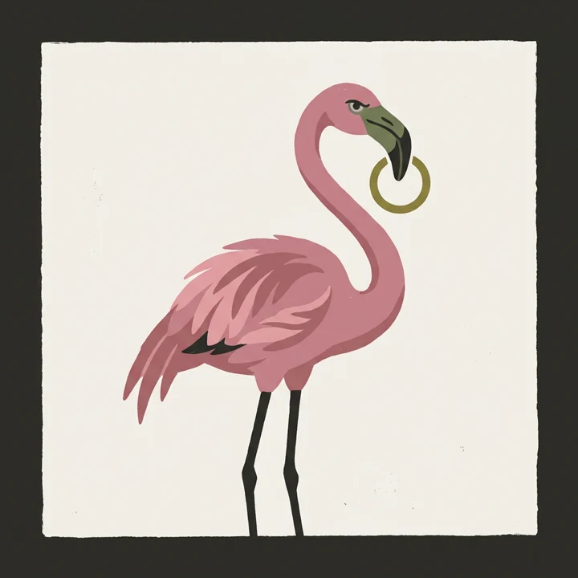
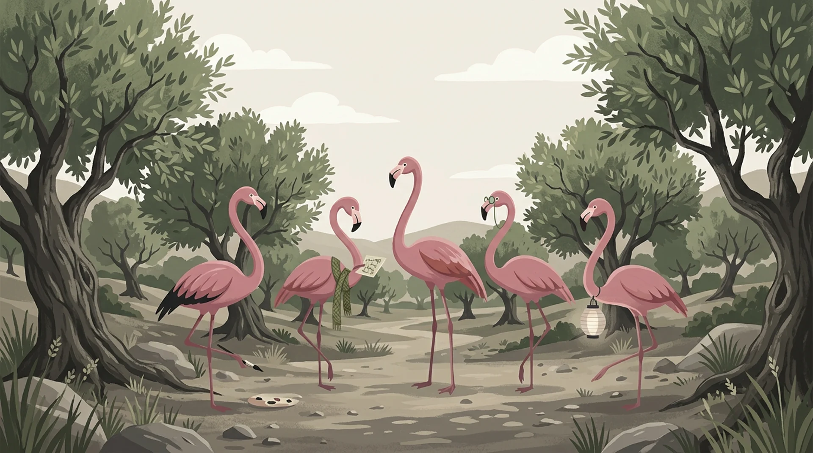
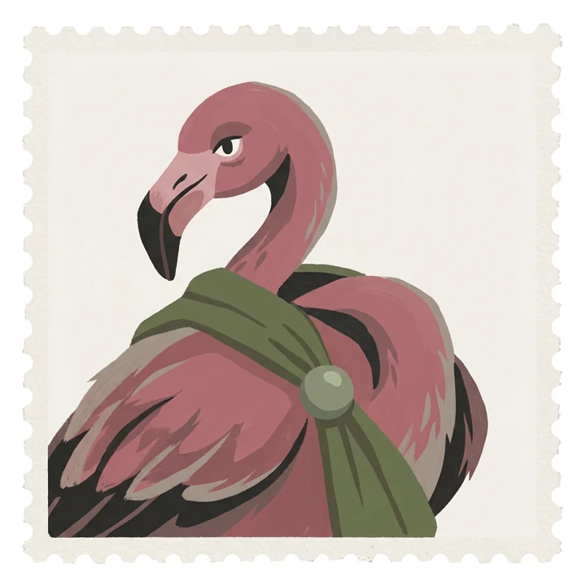
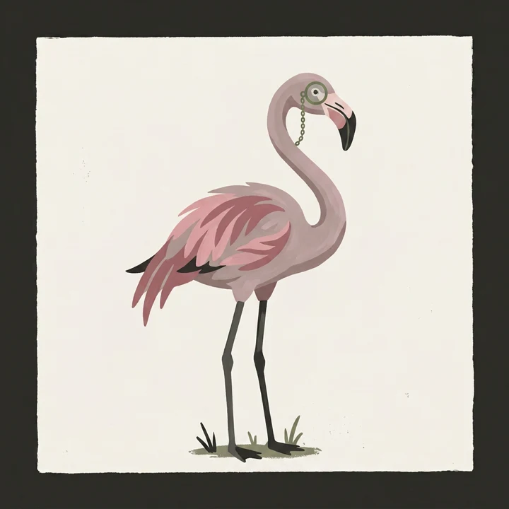
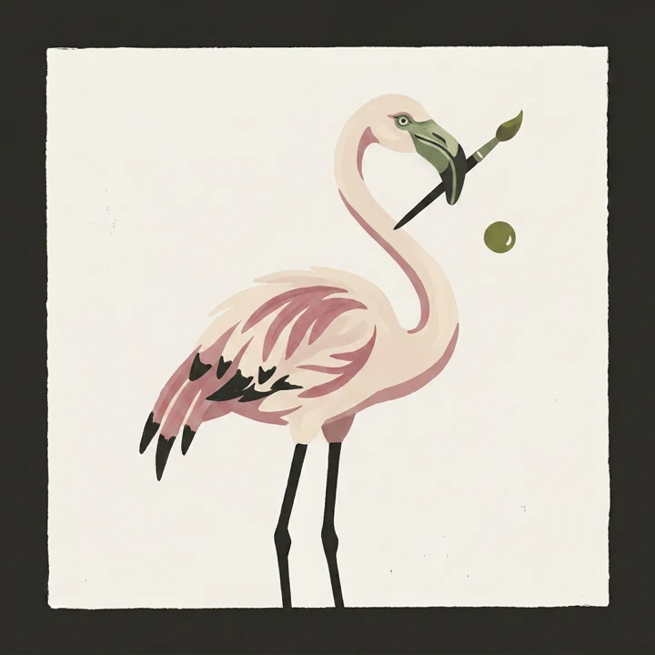
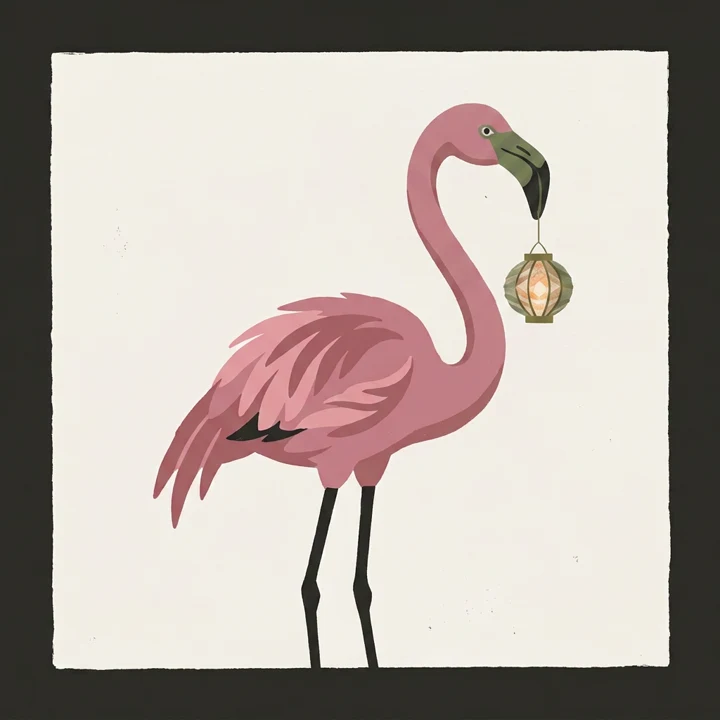
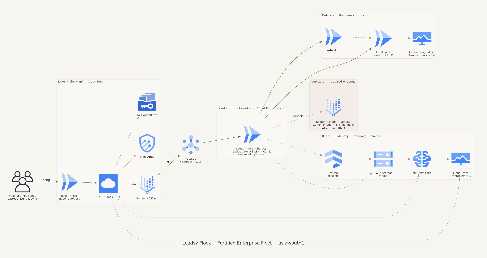

<p align="center">
  
</p>

<h1 align="center">Leadsy Flock</h1>

<p align="center">
  <b>An AI growth agency for neighbourhood shops.</b><br/>
  Paste a listing you own. Scout reads it. Inka films from this shop’s own photos.<br/>
  Stella hands you a paste kit. Flo never autoposts. The owner says YES.
</p>

<p align="center">
  <a href="https://flock-api-533880600838.asia-south1.run.app/demo"><strong>Open the judge demo →</strong></a>
  &nbsp;·&nbsp;
  <a href="https://flock-api-533880600838.asia-south1.run.app/architecture">Architecture</a>
  &nbsp;·&nbsp;
  <a href="https://flock-api-533880600838.asia-south1.run.app/dash">Observatory</a>
  &nbsp;·&nbsp;
  <a href="https://flock-api-533880600838.asia-south1.run.app/blog">Blog</a>
</p>

<p align="center">
  Google All Things Agentic · 27–31 August 2026 · Gemini 3.5 · Google ADK · Cloud Run <code>asia-south1</code><br/>
  <em>This project was created for the purposes of entering Google's All Things Agentic hackathon.</em>
</p>

<p align="center">
  
</p>

---

## For judges — how to see the demo

You do **not** need a login, a Google Cloud project, or a YES on a live campaign. The public roost is a **seeded Glen’s Bakehouse kit** (`google-listing-eaf57cae`). Hire is closed so a blog link cannot burn Vertex. Watch the audition. Do **not** email, call, or review the bakery.

### 1. The roost (start here)

**[https://flock-api-533880600838.asia-south1.run.app/demo](https://flock-api-533880600838.asia-south1.run.app/demo)**

Wait on this page. Do not skip.

| Beat | What you should see |
|---|---|
| **1 · Paste** | The box starts **empty**. Glen’s Google listing types in: `https://share.google/rLF34cfolz9TJA92F` |
| **2 · Hire** | Hire the flock pulses, then clicks. **No real campaign starts.** |
| **3 · YES** | YES is the expensive door. Flo still does not autopost. |
| **4 · Work** | Scout → Inka → Harvest → Gate → Stella → Kit, one line each |
| **5 · Kit** | The paste kit loads in the roost |

`GET /` redirects here. Hard-refresh if the old fast play is cached.

### 2. Open these next (same seed)

| What | Open this |
|---|---|
| **Paste kit** — Meta / WhatsApp / Google slots, English + Hindi, UTMs, own-shop stills & films | [**/k/google-listing-eaf57cae**](https://flock-api-533880600838.asia-south1.run.app/k/google-listing-eaf57cae) |
| **Landing** — consent checkbox, UTM hit on the record, no autopost | [**/l/google-listing-eaf57cae**](https://flock-api-533880600838.asia-south1.run.app/l/google-listing-eaf57cae) |
| **Observatory** — tokens, tools, models, Vertex **list-price** burn **$6.41 · ₹545** (not a Google invoice) | [**/dash**](https://flock-api-533880600838.asia-south1.run.app/dash) |
| **Architecture diagram** | [**/architecture**](https://flock-api-533880600838.asia-south1.run.app/architecture) |
| **Hackathon write-up** | [**/blog**](https://flock-api-533880600838.asia-south1.run.app/blog) |

Optional second device:  
[landing with UTM](https://flock-api-533880600838.asia-south1.run.app/l/google-listing-eaf57cae?utm_source=meta&utm_medium=paid&utm_campaign=google-listing-eaf57cae&utm_content=meta_feed) — that is “run ads” without posting.

### 3. Please do not

- Contact Glen’s Bakehouse. Public listing, pipeline proof, not a customer.
- Tap YES on a real campaign, or paste a shop you do not own.
- Expect `POST /v1/campaigns`, `/docs`, or ADK `/run_sse` — they **404** on purpose.

---

## The flock

<table>
  <tr>
    <td align="center" width="20%">
      <br/>
      <b>Flo</b><br/>
      <sub>Director · ADK + Gemini 3.5 Flash</sub>
    </td>
    <td align="center" width="20%">
      <br/>
      <b>Bri</b><br/>
      <sub>Strategist · YES before Veo</sub>
    </td>
    <td align="center" width="20%">
      <br/>
      <b>Scout</b><br/>
      <sub>Tracker · Search, Maps, own site</sub>
    </td>
    <td align="center" width="20%">
      <br/>
      <b>Inka</b><br/>
      <sub>Artist · own photos → Veo 3.1</sub>
    </td>
    <td align="center" width="20%">
      <br/>
      <b>Stella</b><br/>
      <sub>Host · consent landing + kit</sub>
    </td>
  </tr>
</table>

A neighbourhood shop pastes a listing it **owns**. Flo waits for a human **YES**. Pub/Sub fans **Scout → Inka → Harvest → Ledge → Stella → Ad Kit** on `flock-worker`. Inka paints from **this shop’s own photos** — never fake UGC, never an Adshelf scrape. ffmpeg crops one 8s master into Meta 4:5 / 1:1 / 9:16 and Google 1.91:1. The owner **pastes**. The flock **never autoposts**.

Ground-up rebuild on the mandatory Google stack. Same product idea as an earlier prototype on a different stack — **no application code copied.** See [DISCLOSURE.md](DISCLOSURE.md).

---

## Architecture

<p align="center">
  
</p>

<p align="center"><a href="https://flock-api-533880600838.asia-south1.run.app/architecture">Live diagram</a></p>

**Cloud Run `flock-api`** is the door (request-shaped). **Pub/Sub `campaign-steps`** is the spine (one message, one step, one receipt). **Cloud Run `flock-worker`** does the long work. Inka **starts** Veo and returns; a harvest sidecar polls so we never wait on film inside the interactive path.

| Mandatory | How we use it |
|---|---|
| Gemini 3.5+ | `gemini-3.5-flash` via Vertex — Flo, copy, gate judge |
| Google agent framework | ADK 2.x (`agents-cli`), A2A AgentCard |
| Google Cloud service | Cloud Run `flock-api` + `flock-worker`, `asia-south1` |

**Also on the job:** Model Armor, Memory Bank, Cloud Trace, Firestore receipts, Cloud Storage films, Search + Maps, Veo 3.1, Gemini Image (fallback still), Gemini TTS (English + Indic), Gemma on the Creative Gate, Lyria when quota allows.

Lowest cost is a series of refusals: no Veo until YES, no second Veo for a square crop, no fake UGC, no autopost, no hiding the burn.

---

## Cost we actually show

The [observatory](https://flock-api-533880600838.asia-south1.run.app/dash) reconstructs Vertex **list price** for the Glen’s seed: **$6.41 · ₹545**, almost all of it Veo at $0.40/s. That is **not** a Google invoice and **not** a hire SKU.

---

## Public lock

The site stays up for the tweet. The **API does not**.

| Open | Closed (404) |
|---|---|
| `/demo`, `/k/google-listing-eaf57cae`, `/l/google-listing-eaf57cae`, `/media/google-listing-eaf57cae/*` | `POST /`, `POST /v1/campaigns`, YES / `/r`, studio `/s` |
| `/blog`, `/architecture`, `/dash`, `/health` | `/docs`, `/openapi.json`, ADK `/run` `/run_sse` `/apps` `/a2a` |

Worker Pub/Sub push is unchanged.

---

## Spin-up (operators)

```bash
curl -LsSf https://astral.sh/uv/install.sh | sh
uv tool install "google-agents-cli~=1.4.1"
gcloud auth application-default login
cp .env.example .env                    # GOOGLE_CLOUD_PROJECT
bash scripts/provision_infra.sh
bash scripts/deploy_services.sh
```

Public hire stays locked unless you set `FLOCK_PUBLIC_LOCK=0` on a private revision. Do not open hire toward a shop you do not own.

```
app/                 Flo (ADK) + FastAPI + lock + ledger + worker
app/static/flock/    roost art, theater, kit, architecture.png
web/                 Mission Control starter
scripts/             provision, deploy, architecture PNG
docs/                architecture.png, blog, social copy
DISCLOSURE.md        pre-existing work statement
```

Notes: [DAY1.md](DAY1.md) · [DAY2.md](DAY2.md) · [DAY3.md](DAY3.md) · [DAY4.md](DAY4.md) · [design.md](design.md). Pulse / OpenSEO is parked in [PULSE.md](PULSE.md).

Built for **Fortified Enterprise Fleet** (AgentCards, gates, traces, Memory Bank). Falls back to **Taskmaster** if the governance surface slips.

Apache-2.0. Scaffolding © Google LLC.
